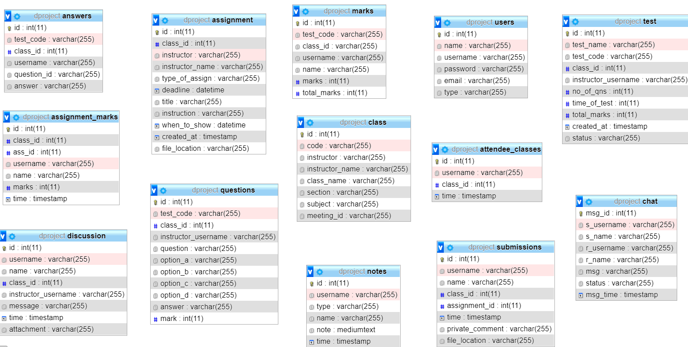

# Class-ified
A online learning platform with integrated test portal, online video conferencing and also with real time recorder functionality to record streams.

In this README:

- [Introduction](#introduction)
- [Installation](#installation)
- [Contributing Guidelines](#Contributing-Guidelines)

## Introduction

Ever Wanted to change the way Online classes work?, well have you wanted to add your own customisations and execute your own creative ideas and make the experience of Online education better ?...you are absolutely at the right place. Class-ified is the project which was aimed to do the same and which came out of the quest to make online eduaction better and improve the whole experience of both the student and teaching community. Even though there are many platforms which facilitate this, some of the class-ified features like integrated test portal, and real time recording feature which also provides an option to upload the recording directly to class-fied play, integrated notesapp which converts the voice into text seemlessly and saves it, etc gives an amazing learning experience.

## Installation

1. Install XAMPP
2. `git clone https://github.com/sreecharan-m/class-ified`.
3. Pull all the files inside `htdocs` folder inside xampp.
4. Create the Db with the help of DB schema diagram attached.
5. Run The application in localhost

## Database Schema

## Contributing Guidelines

Want to contribute to Class-ified? Here are some guidelines for how we accept help.

### Submitting a Pull Request

1. [Fork](https://github.com/sreecharan-m/class-ified/fork) and clone the repository.
1. Comment on the issue that you are gonna take up, indicating the approximate time you would take to finish it.
1. After finishing, push to your fork and [submit a pull request](https://github.com/sreecharan-m/class-ified/compare).
1. Wait for your `pull request` to be reviewed and merged.
1. In the meantime you can take up other issues as well.

### Reporting Bugs and Issues

 We use [GitHub Issues](https://github.com/sreecharan-m/class-ified/issues) to track bugs, so please do a search before submitting to ensure your problem isn't already tracked.

### New Issues

Please provide the expected and observed behaviours in your issue.

### Proposing a Change

If you intend to implement a feature, or make a non-trivial change to the current implementation, we recommend [first filing an issue](https://github.com/sreecharan-m/class-ified/issues/new) marked with the `proposal` tag, so that the engineering team can provide guidance and feedback on the direction of an implementation.  This also help ensure that other people aren't also working on the same thing.
